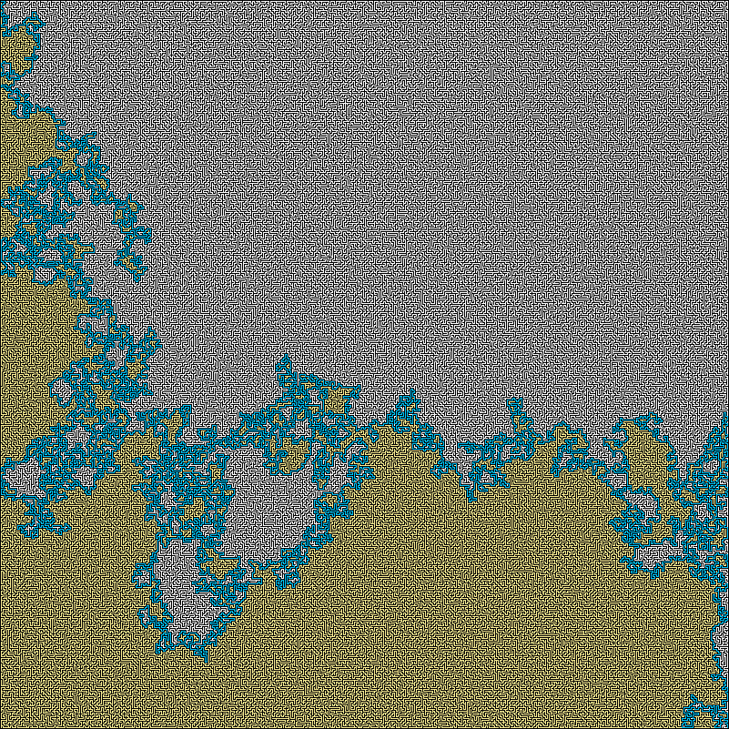

# MAZE
True maze generator with depth-first search/recursive backtracking. Maze solver uses right handfollowing algorithm. Generator script will make mazes based on sizes specified in `sizes.txt`. The solver script needs the input maze(s) to be specified. 

True mazes contain no loops, i.e. there is only a single viable path from start to finish. For solved mazes, all traversed spaces are colored yellow, while the final path is colored blue.
